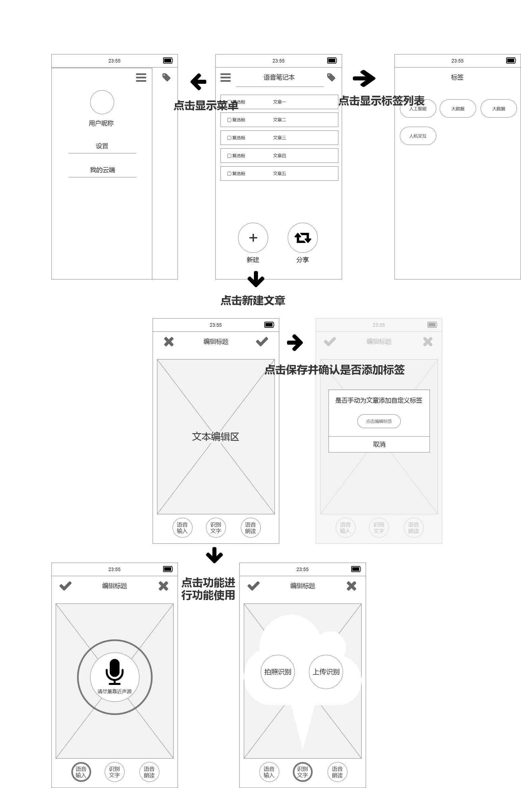

### product requirements

| 发布日期 | 18/11/25 |
|----|----|
| 史诗 | 让用户可以语音输入、识别图片文字，并能智能纠错、给文章打标签、语音朗读文章内容的语音记事本app |
| 文件现状 | 未起头 |
| 文件主人 | 刘诗颖 |
| 领头的设计师 | |
| 领头的开发者 | |
| 领头的测试者| |

### 目标

- 帮助用户解放双手和双眼，用语音、智能纠错功能与带有文字的图片便能记录文字，用语音朗读与标签功能便能快速获取信息。为用户带来更便捷快速的用户体验，构建一个帮助用户提升技能，快速记录与思考的工具。

### 背景和战略契合处
- 在高速发展的社会下，人们总面对着瞬息万变的信息。为了不与世界脱节，便需要更快地行动与更好的节省时间和精力。当你想快速记录下老板、老师们的长篇大论时，双手打字的速度总是比不上耳朵听的快。当你想把一篇文章中的精华部分摘抄下来却不想用麻烦的选择复制功能或只收到一张写满字的图片时，把它截屏成图片或直接上传便能快速将其变成可供修改的文字。当你想重温之前写下的文章，却找不到它，找到了也疲惫地不想用眼睛看时，文章标签与语音朗读会帮到你。

### 情境假设
- 用户使用时需要在手机上使用。
- 用户使用语音输入功能时，需要给出麦克风权限。
- 用户使用图片上传功能时，需要给出存储与摄像头功能。
- 用户使用分享或云端功能时，需要联网。

###  需求
|#| 用户案例 | 标题 |重要程度 |笔记|
|----|----|----|----|----|
|1| 语音转化文字 | 语音转文字 |5 | | 
|2| 语音朗读 | 朗读 |2 | | 
|3| 文章标签 | 文章标签 |1| | 
|4| 通用文字识别 | 图片转文字 | 3| | 
|5| 文本纠错 | 智能纠错 | 4| | 

### 使用者交互及设计

### 问题

|问题|解决|
|---|---|
|双手打字太慢|使用语音转文字|
|用眼睛阅读会产生疲劳|语音朗读|
|文章太多时找不到想要的|使用标签功能|
|只有图片|图片转换|
|只在本地端有备份|登录使用云端功能或分享到其他社交平台|

### 不做
- 上线搜索功能
